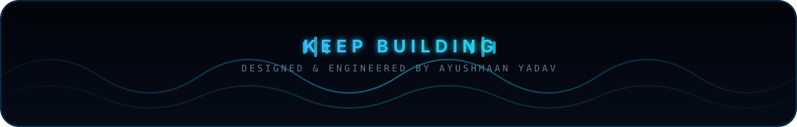

<div align="center">



<br/>

<a href="https://github.com/Ayuuu-tech?tab=repositories"></a>
<a href="https://github.com/Ayuuu-tech"></a>
<a href="https://github.com/Ayuuu-tech"></a>
<a href="mailto:yash.sharma4205@gmail.com"></a>

<br/><br/>


<br/>


<br/>



<br/><br/>


<br/>


</div>

<br/>

```
    ┌──────────────────────────────────────────────────────────────────────────┐
    │   ayushmaan@dev ─ neofetch                                               │
    ├──────────────────────────────────────────────────────────────────────────┤
    │                                                                          │
    │        ▄▄▄▄▄▄▄▄▄▄▄            user ......... Ayushmaan Yadav             │
    │      ▄█████████████▄          role ......... Software Developer          │
    │     ███▀         ▀███         host ......... India / UTC+05:30           │
    │    ███   ▄█████▄   ███        shell ........ zsh · linux                 │
    │    ███   ███████   ███        editor ....... vs code · neovim            │
    │    ███   ▀█████▀   ███        core ......... java · typescript · python  │
    │     ███▄         ▄███         backend ...... nestjs · node · express     │
    │      ▀█████████████▀          data ......... postgresql · prisma · mongo │
    │        ▀▀▀▀▀▀▀▀▀▀▀            cloud ........ docker · aws · nginx        │
    │                               studying ..... dsa · system design         │
    │    ████ ████ ████ ████        building ..... enercore · smartscan        │
    │    ████ ████ ████ ████        uptime ....... shipping daily              │
    │                                                                          │
    └──────────────────────────────────────────────────────────────────────────┘
```

<br/>

<table align="center" width="900">
<tr>
<td width="50%" valign="top">

### `//` PROFILE

I am a **Software Developer** from India who cares about what happens
*after* the demo works — correctness under load, clean boundaries, and
systems that stay maintainable at scale.

I spend my time in backend engineering and system design, writing Java
and TypeScript, sharpening DSA daily, and shipping production platforms
end to end — schema, API, infrastructure, and interface.

</td>
<td width="50%" valign="top">

### `//` MISSION

> **Become a world-class Software Engineer and build scalable products
> used by millions.**

Every project is chosen as a rep toward that: real users, real data,
real deployment. Not tutorials — production workloads with monitoring,
auth, payments, and uptime that actually matters.

</td>
</tr>
</table>

<div align="center">

<br/>


<br/>


<br/>

<table width="900">
<tr>
<td align="center" width="25%">

<br/>
**SYSTEM DESIGN**<br/>
<sub>Scalability · Caching · Queues<br/>Consistency · Fault tolerance</sub>

</td>
<td align="center" width="25%">

<br/>
**BACKEND ENGINEERING**<br/>
<sub>NestJS · Node · Prisma<br/>REST · JWT · Postgres</sub>

</td>
<td align="center" width="25%">

<br/>
**JAVA & DSA**<br/>
<sub>Core Java · Collections<br/>Algorithms · Complexity</sub>

</td>
<td align="center" width="25%">

<br/>
**CLOUD & AI**<br/>
<sub>Docker · AWS · CI/CD<br/>LLM-backed features</sub>

</td>
</tr>
</table>

<br/>


<br/>


<br/>

<table width="900">
<tr><td align="center">

**LANGUAGES**


</td></tr>
<tr><td align="center">

**FRONTEND**


</td></tr>
<tr><td align="center">

**BACKEND**


</td></tr>
<tr><td align="center">

**DATA**


</td></tr>
<tr><td align="center">

**CLOUD & DEVOPS**


</td></tr>
<tr><td align="center">

**TOOLING**


</td></tr>
</table>

<br/>


<br/>


<br/>

<table width="900">
<tr>
<td width="50%"></td>
<td width="50%"></td>
</tr>
<tr>
<td width="50%"></td>
<td width="50%" valign="middle" align="center">

**`ENERCORE`** — production solar intelligence: live telemetry ingestion,
analytics, payments and an admin control plane, on Flutter + NestJS +
Prisma + PostgreSQL, containerised with Docker.

**`SMARTSCAN`** — AI card scanner turning captured images into structured,
queryable contact records through an OCR pipeline.

**[`LAUNDRY BUDDY`](https://github.com/Ayuuu-tech/Laundary-Buddy)** — end-to-end laundry SaaS with JWT auth,
role-based access and order lifecycle management.

</td>
</tr>
</table>

<br/>


<br/>


<br/>


<br/>


<br/><br/>


<br/>


<br/>


<br/>


<br/>

<picture>
  <source media="(prefers-color-scheme: dark)" srcset="https://raw.githubusercontent.com/Ayuuu-tech/Ayuuu-tech/output/snake-dark.svg" />
  <source media="(prefers-color-scheme: light)" srcset="https://raw.githubusercontent.com/Ayuuu-tech/Ayuuu-tech/output/snake.svg" />
  
</picture>

<br/>


<br/>


</div>

<br/>

<table align="center" width="900">
<tr>
<td width="50%" valign="top">

### `//` EXPERIENCE

```
●  NOW      Solo engineering — Enercore
│           Production solar intelligence platform.
│           Flutter · NestJS · Prisma · PostgreSQL · Docker
│
●  RECENT   SmartScan — AI card scanner
│           OCR pipeline, structured extraction, mobile client.
│
●  EARLIER  Laundry Buddy — SaaS backend
│           Node · Express · JWT · role-based access.
│
●  BASE     Fundamentals
            Java, DSA, databases, Linux, Git workflows.
```

</td>
<td width="50%" valign="top">

### `//` LEARNING PATH

```
[██████████] Java · OOP · Collections
[█████████░] REST API design · Auth
[█████████░] PostgreSQL · Prisma · modelling
[████████░░] Docker · CI/CD pipelines
[███████░░░] DSA · problem solving
[██████░░░░] System design at scale
[█████░░░░░] AWS · cloud architecture
[████░░░░░░] AI / LLM integrations
```

</td>
</tr>
</table>

<div align="center">

<br/>


<br/>


<br/>

<a href="mailto:yash.sharma4205@gmail.com"></a>
<a href="https://github.com/Ayuuu-tech"></a>
<a href="https://www.linkedin.com/in/ayushmaan-yadav2006/"></a>

<br/><br/>


<br/><br/>


<br/><br/>



</div>
